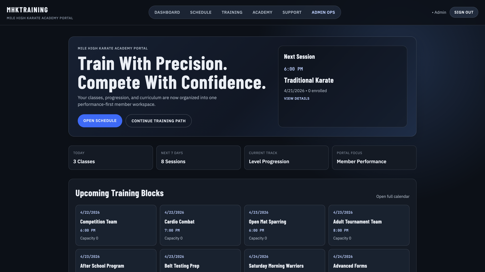
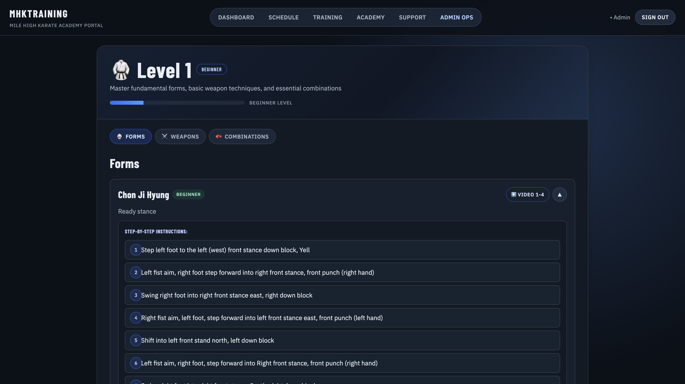
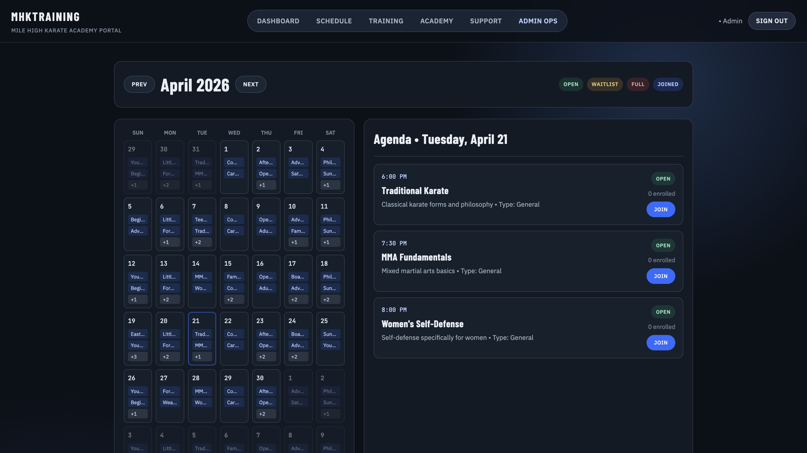
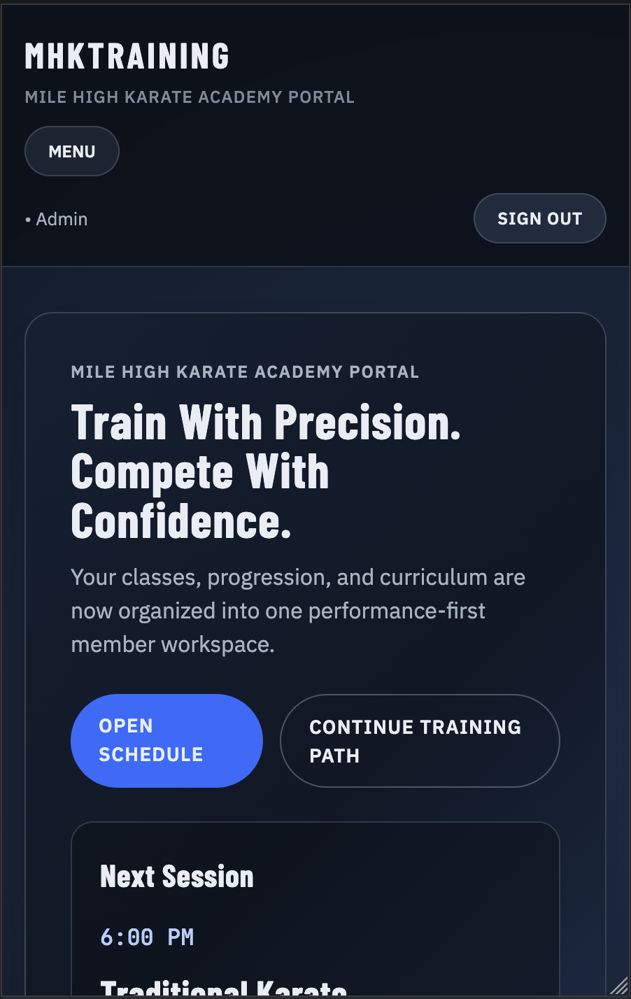

# Mile High Karate

Mile High Karate is a training portal for students, instructors, and admins. It helps members follow belt-level curriculum, review upcoming classes, and stay organized in one place.

The app is a React + Vite single-page application with a mock data layer and role-aware routes. Right now it runs fully on the frontend and is deployed through AWS Amplify.

## Live Demo

**Production:** [https://www.mhktraining.com](https://www.mhktraining.com)

**Demo Access:** Open access - authentication uses localStorage (no backend required)

---

## Core Features

- **Belt-Level Learning Modules** - Progressive technique training from white belt to black belt degrees with video instruction
- **Event Management System** - 14-month schedule with 1700+ classes, tournaments, seminars, and belt tests
- **Role-Based Access Control** - Student, instructor, and admin permissions with protected routes
- **Responsive UI/UX** - Mobile-first design with CSS Modules, optimized for all devices
- **Session Persistence** - Auth tokens stored in localStorage (login state persists across page refreshes)

---

## Screenshots

### Dashboard



### Training Experience



### Schedule View



### Mobile Layout



---

## Architecture

```
┌─────────────────────────────────────────────────────────┐
│                   AWS Amplify (CDN)                     │
│                                                         │
│  ┌───────────────────────────────────────────────────┐ │
│  │  React 19 + Vite 6 (Frontend SPA)                 │ │
│  │  ├─ React Router - Client-side routing            │ │
│  │  ├─ Context API - Auth state management           │ │
│  │  ├─ CSS Modules - Component styling               │ │
│  │  └─ Mock API - Event data (1700+ items)           │ │
│  └───────────────────────────────────────────────────┘ │
└─────────────────────────────────────────────────────────┘

Auth Flow: Login → Validate → Context Update → localStorage → Protected Routes
```

**Tech Stack:**

- **Frontend:** React 19, React Router 7, Vite 6.3.5
- **State Management:** Context API + localStorage
- **Data Layer:** Client-side mock API (1700+ pre-generated events)
- **Deployment:** AWS Amplify with automatic CI/CD

---

## Local Setup

```bash
# Clone and install
git clone https://github.com/ZacksBroDev/MHKWebsite.git
cd MHKWebsite
npm install

# Run development server
npm run dev
# → http://localhost:5173

# Build for production
npm run build
```

---

## Environment Variables

Optional configuration via `.env` file:

```bash
# Google Analytics (Optional)
VITE_GA_MEASUREMENT_ID=G-XXXXXXXXXX
```

**Note:** No environment variables are required to run the application locally. Analytics tracking is optional.

---

## Deployment

**AWS Amplify (Current):**

- Automatic builds on push to `main`
- Custom domain: `www.mhktraining.com`
- SSL/TLS via AWS Certificate Manager
- Global CDN distribution

**Deployment Config (`amplify.yml`):**

```yaml
version: 1
frontend:
  phases:
    preBuild:
      commands:
        - npm install
    build:
      commands:
        - npm run build
  artifacts:
    baseDirectory: dist
    files:
      - "**/*"
```

**Manual Deploy:**

```bash
npm run build
# Upload dist/ folder to hosting provider
```

---

## Data Persistence Model

**What Persists (localStorage):**

- Authentication tokens - Login sessions survive page refreshes
- User role (admin/student) - Maintains access permissions

**What Doesn't Persist (Mock Data):**

- Event data - 1700+ events loaded from static mock API on each session
- User profiles - No database; profiles reconstructed from tokens
- Admin changes - Cannot create/edit/delete events (static dataset)

**Current Architecture:** Frontend-only SPA with mock API. Backend integration planned for Q1 2026 (see [Roadmap](#roadmap)).

---

## Known Limitations

- **Mock Backend** - No real API; all data is static and client-side
- **No CRUD Operations** - Cannot create, edit, or delete events/users (admin UI is view-only)
- **Demo Authentication** - Any email/password works; no real credential validation

---

## Browser Support

- **Chrome/Edge:** v90+
- **Firefox:** v88+
- **Safari:** v14+
- **Mobile:** iOS Safari 14+, Chrome Android 90+

---

## Testing

**Manual Testing:**

```bash
npm run dev
# Test user flows:
# 1. Sign up/login with any email
# 2. Navigate belt learning modules
# 3. Browse event schedule
# 4. Test mobile responsive design
```

**Build Verification:**

```bash
npm run build
npm run preview
# Verify production build works correctly
```

---

## Contributing

1. Fork the repository
2. Create a feature branch: `git checkout -b feature/your-feature`
3. Test your changes: `npm run dev` and `npm run build`
4. Commit with clear messages: `git commit -m 'feat: add feature'`
5. Push and open a Pull Request

**Guidelines:**

- Follow existing code patterns and CSS Modules structure
- Test on mobile and desktop browsers
- Ensure `npm run build` succeeds

---

## Roadmap

**Q1 2026:**

- **Backend Integration** - Node.js/Express + MongoDB API for real data persistence (in progress)
- User authentication with JWT
- Real-time event creation/management
- Database schema for users, events, and progress tracking

**Q2 2026:**

- **Progress Tracking** - Student analytics dashboard
- Training history with attendance tracking
- Belt progression milestones and requirements
- Performance metrics and achievement badges

**Q3 2026:**

- **Video Integration** - Embedded technique demonstrations
- YouTube API integration for learning modules
- Technique videos organized by belt level
- Progress tracking for video completion

---

## Author

**Zackary Brown** - Full Stack Developer

[GitHub](https://github.com/ZacksBroDev) • [LinkedIn](https://linkedin.com/in/zackaryzbrown) • [Instagram](https://instagram.com/zackfullstack) • [YouTube](https://youtube.com/@ZackFullStack)

---

## License

Developed for educational and community purposes. Please use responsibly.

_"The ultimate aim of karate lies not in victory nor defeat, but in the perfection of the character of its participants."_ - Gichin Funakoshi
